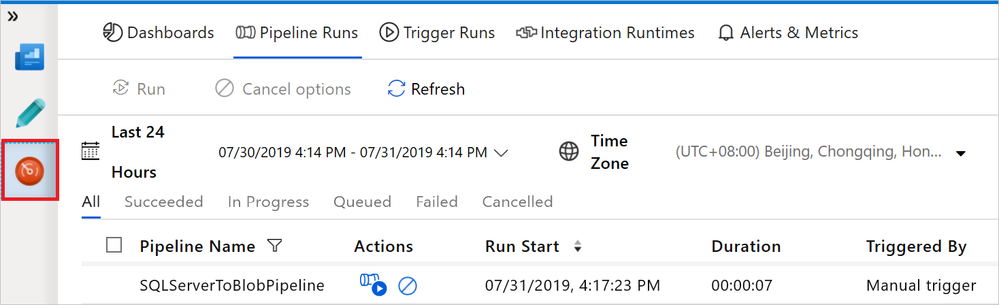

## Copia de datos de una base de datos de SQL Server local en Azure Blob Storage

En este tutorial, realizará los siguientes pasos:

- Creación de una factoría de datos.
- Creación de una instancia de Integration Runtime autohospedada.
- Creación de los servicios vinculados SQL Server y Azure Storage.
- Creación de los conjuntos de datos de SQL Server y Azure Blob.
- Creación de una canalización con una actividad de copia para mover los datos.
- Inicio de la ejecución de una canalización.
- Supervisión de la ejecución de la canalización

#### Prerrequisitos

Consulte la sección [Prerrequisitos](Prerrequisitos.md).

#### Creación de la factoría de datos

Para crear una factoría de datos consulte [Creación de una factoría de datos](Creaci%C3%B3n%20de%20una%20factor%C3%ADa%20de%20datos.md)

#### Creación de la canalización

------

1. En la página **Let's get started** (Introducción) seleccione **Create pipeline** (Crear canalización).
2. En la pestaña **General** de la parte inferior de la ventana **Properties** (Propiedades), en **Name** (Nombre), escriba **SQLServerToBlobPipeline**.
3. En el cuadro de herramientas **Activities** (Actividades), expanda **Move & Transform** (Mover y transformar). Arrastre y coloque la actividad **Copy** (Copiar) en la superficie de diseño. Establezca el nombre de la actividad en **CopySqlServerToAzureBlobActivity**.
4. En la ventana **Properties** (Propiedades), cambie a la pestaña **Source** (Origen) y haga clic en **+ New** (+ Nuevo).
5. En el cuadro de diálogo **New Dataset** (Nuevo conjunto de datos), busque **SQL Server**. Seleccione **SQL Server** y, luego, **Continue** (Continuar).
6. En el cuadro de diálogo **Set Properties** (Establecer propiedades), en **Name** (Nombre), escriba **SqlServerDataset**. En **Linked service** (Servicio vinculado), seleccione **+ New** (+ Nuevo).
7. En el cuadro de diálogo **New Linked Service** (Nuevo servicio vinculado) agregue **SqlServerLinkedService** en **Name** (Nombre). En **Connect via integration runtime** (Conectar mediante IR), seleccione **+New** (+ Nuevo). En esta sección se crea una instancia de Integration Runtime autohospedada y se asocia con un equipo local con la base de datos de SQL Server.
8. En el cuadro de diálogo **Integration Runtime Setup** (Configuración de Integration Runtime), seleccione **Self-Hosted** (Autohospedado) y, después, seleccione **Next** (Siguiente).
9. Como nombre, escriba **TutorialIntegrationRuntime**. Luego, seleccione **Next**.
10. En Settings (Configuración), seleccione **Click here to launch the express setup for this computer** (Haga clic aquí para iniciar la configuración rápida de este equipo). Esta acción instala Integration Runtime en la máquina y lo registra con Data Factory.
11. En la ventana **Integration Runtime (Self-hosted) Express Setup** (Configuración rápida de Integration Runtime [autohospedado]), seleccione **Close** (Cerrar).
12. En el cuadro de diálogo **New Linked Service** (Nuevo servicio vinculado), confirme que **TutorialIntegrationRuntime** está seleccionado en **Connect via integration runtime** (Conectar a través de IR). A continuación, siga estos pasos:
    - En **Name** (Nombre), escriba **SqlServerLinkedService**.
    - Escriba el nombre de la instancia de SQL Server en **Server name** (Nombre del servidor).
    - En el campo **Database name** (Nombre de la base de datos) especifique el nombre de la base de datos con la tabla **emp**.
    - En **Authentication type** (Tipo de autenticación) seleccione el tipo de autenticación adecuado que Data Factory debe usar para conectarse a la base de datos de SQL Server.
    - En **User name** (Nombre de usuario) y **Password** (Contraseña), escriba el nombre de usuario y la contraseña. Si necesita usar una barra diagonal inversa (\\) en la cuenta del usuario o en el nombre del servidor, utilice el carácter de escape (\\) antes.
    - Seleccione **Test connection** (Probar conexión). Este paso permite confirmar que el servicio Data Factory puede conectarse a la base de datos de SQL Server.
    - Para guardar el servicio vinculado, seleccione **Finish** (Finalizar).
13. Debería volver a la ventana con el conjunto de datos de origen abierto. En la pestaña **Connection** (Conexión) en la ventana **Properties** (Propiedades), realice los pasos siguientes:
    - En **Linked service** (Servicio vinculado) confirme que ve **SqlServerLinkedService**.
    - En **Table** (Tabla), seleccione **[dbo].[emp]** .
14. Vaya a la pestaña con **SQLServerToBlobPipeline** o seleccione **SQLServerToBlobPipeline** en la vista de árbol.
15. Vaya a la pestaña **Sink** (Receptor) en la parte inferior de la ventana **Properties** (Propiedades) y seleccione **+ New** (+ Nuevo).
16. En el cuadro de diálogo **New Dataset** (Nuevo conjunto de datos), seleccione **Azure Blob Storage**. Después, seleccione **Continue**.
17. En el cuadro de diálogo **Select Format** (Seleccionar formato), elija el tipo de formato de los datos. Después, seleccione **Continue**.
18. En el cuadro de diálogo **Set Properties** (Establecer propiedades), escriba **AzureBlobDataset** como nombre. Junto al cuadro de texto **Linked service** (Servicio vinculado), seleccione **+ New** (+Nuevo).
19. En el cuadro de diálogo **New Linked Service (Azure Blob Storage)** [Nuevo servicio vinculado (Azure Blob Storage)], escriba **AzureStorageLinkedService** como nombre; en la lista de nombres **Storage account** (Cuenta de Storage) seleccione la cuenta de Storage. Pruebe la conexión y, a continuación, seleccione **Finish** (Finalizar) para implementar el servicio vinculado.
20. Una vez creado el servicio vinculado, se vuelve a la página **Set Properties** (Establecer propiedades). Seleccione **Continue**.
21. Debería volver a la ventana con el conjunto de datos receptor abierto. En la pestaña **Connection** (Conexión), realice los pasos siguientes:
    - En **Linked service** (Servicio vinculado) confirme que **AzureStorageLinkedService** está seleccionado.
    - En **File path** (Ruta de acceso del archivo), escriba **adftutorial/fromonprem** en la parte **Container / Directory** (Contenedor / Directorio). Si no existe la carpeta de salida en el contenedor adftutorial, Data Factory la crea automáticamente.
    - En la parte **File** (Archivo), seleccione **Add dynamic content** (Agregar contenido dinámico).
    - Agregue `@CONCAT(pipeline().RunId, '.txt')` y, después, seleccione **Finish** (Finalizar).
22. Vaya a la pestaña con la canalización abierto o seleccione la canalización en la vista de árbol. En **Sink Dataset** (Conjunto de datos receptor) confirme que **AzureBlobDataset** está seleccionado.
23. Para comprobar la configuración de la canalización, seleccione **Validate** (Validar) en la barra de herramientas. Para cerrar **Pipeline Validation Report** (Informe de validación de la canalización), seleccione **Close** (Cerrar).
24. Para publicar las entidades que creó en Data Factory, seleccione **Publish All** (Publicar todo).
25. Espere hasta ver el mensaje emergente **Publishing succeeded** (Publicación correcta). Para comprobar el estado de la publicación, seleccione el vínculo **Show Notifications** (Mostrar notificaciones) de la parte superior de la ventana. Para cerrar la ventana de notificaciones, seleccione **Close** (Cerrar).

------

#### Desencadenamiento de una ejecución de la canalización

Seleccione **Add Trigger** (Agregar desencadenador) en la barra de herramientas para la canalización y, después, seleccione **Trigger Now** (Desencadenar ahora).

#### Supervisión de la ejecución de la canalización

------

1. Vaya a la pestaña **Monitor** (Supervisar). Verá la canalización que ha desencadenado manualmente en el paso anterior.

   

2. Para ver las ejecuciones de actividad asociadas con la ejecución de canalización, seleccione el vínculo **View Activity Runs** (Ver ejecuciones de actividad) en la columna **Actions** (Acciones). Para ver detalles acerca de la operación de copia, seleccione el vínculo **Details** (Detalles) (icono de gafas) en la columna **Actions** (Acciones). Para volver a la vista Pipeline Runs (Ejecuciones de canalización), seleccione **Pipeline Runs** (Ejecuciones de canalización) en la parte superior.

------

#### Comprobación del resultado

La canalización automáticamente la carpeta de salida *fromonprem* en el contenedor de blobs `adftutorial`. Confirme que ve el archivo *[pipeline().RunId].txt* en la carpeta de salida.

