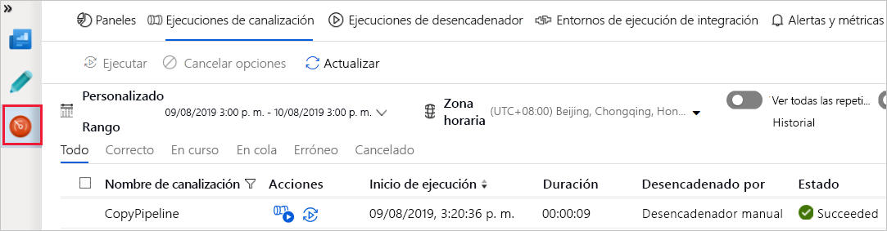

## Creación de una factoría de datos con la interfaz de usuario de Azure Data Factory

#### Información general

En esta guía se describe cómo usar la interfaz de usuario de Azure Data Factory para crear y supervisar una factoría de datos. La canalización que creará en esta factoría de datos copia los datos de una carpeta a otra en Azure Blob Storage.

#### Prerrequisitos

###### Suscripción de Azure

Si no tiene una suscripción a Azure, [puede crear una cuenta gratuita](https://azure.microsoft.com/free/).

###### Roles de Azure

La cuenta debe tener un rol *Contributor* o *Owner* asignado o ser *administrator* de la suscripción de Azure.
Para ver los permisos que tiene en la suscripción, vaya a Azure Portal. En la esquina superior derecha, seleccione su nombre de usuario y luego seleccione **Permissions** (Permisos).

###### Cuenta de Azure Storage

Para crear un contenedor de blobs consulte [Creación de un contenedor de blobs](Creaci%C3%B3n%20de%20un%20contenedor%20de%20blobs.md)

#### Creación de la factoría de datos

Para crear una factoría de datos consulte [Creación de una factoría de datos](Creaci%C3%B3n%20de%20una%20factor%C3%ADa%20de%20datos.md).

#### Creación de un servicio vinculado

En este procedimiento, creará un servicio vinculado para vincular la cuenta de Azure Storage con la factoría de datos. El servicio vinculado tiene la información de conexión que usa el servicio Data Factory en el entorno de tiempo de ejecución para conectarse a él.

------

1. Seleccione **Connections** y después el botón **New** en la barra de herramientas (el botón **Connections** se encuentra en la parte inferior de la columna izquierda debajo de **Factory Resources**).
2. En la página **New Linked Service** (Nuevo servicio vinculado), seleccione **Azure Blob Storage** y después **Continue** (Continuar).
3. En la página Nuevo servicio vinculado (Azure Blob Storage), realice los siguientes pasos:
   - En **Name** (Nombre), escriba **AzureStorageLinkedService**.
   - En **Storage account name** (Nombre de la cuenta de Storage), seleccione el nombre de la cuenta correspondiente.
   - Seleccione **Test connection** (Probar conexión) para confirmar que el servicio Data Factory puede conectarse a la cuenta de almacenamiento.
   - Para guardar el servicio vinculado, seleccione **Finish** (Finalizar).

------

#### Creación de conjuntos de datos

En este procedimiento, creará dos conjuntos de datos: **InputDataset** y **OutputDataset**. Estos datasets son de tipo **AzureBlob**.

En la definición del dataset de entrada, se especifica el contenedor de blobs (**adftutorial**), la carpeta (**input**) y el archivo (**emp.txt**) que contiene los datos de origen.

En la definición del dataset de salida, se especifica el contenedor de blobs (**adftutorial**), la carpeta (**output**) y el archivo en el que se copian los datos. Cada ejecución de un pipeline tiene un identificador único asociado a ella. Puede tener acceso a este identificador mediante el uso de la variable del sistema **RunId**. El nombre del archivo de salida se evalúa dinámicamente según el identificador de ejecución.

------

1. Haga clic en el botón **+** (Más) y seleccione **Dataset** (Conjunto de datos).
2. En la página **New Dataset**, seleccione **Azure Blob Storage** y después **Continue**.
3. En la página **Select Format**, elija el tipo de formato de los datos y, después, seleccione **Continue**. En este caso, seleccione **Binary** al copiar archivos tal cual sin analizar el contenido.
4. En la página **Set Properties**, siga estos pasos:
   - En **Name**, escriba **InputDataset**.
   - En **Linked service** (Servicio vinculado), seleccione **AzureStorageLinkedService**.
   - En **File path** (Ruta del archivo), seleccione el botón **Browse** (Examinar).
   - En la ventana **Choose a file or folder** (Elegir un archivo o carpeta), vaya a la carpeta **input** del contenedor **adftutorial**, seleccione el archivo **emp.txt** y seleccione **Finish** (Finalizar).
   - Seleccione **Continue**.
5. Repita los pasos para crear el conjunto de datos de salida:
   - Haga clic en el botón **+** (Más) y seleccione **Dataset** (Conjunto de datos).
   - En la página **New Dataset**, seleccione **Azure Blob Storage** y después **Continue**.
   - En la página **Select Format**, elija el tipo de formato de los datos y, después, seleccione **Continue**.
   - En la página **Set Properties**, especifique **OutputDataset** para el nombre. Seleccione **AzureStorageLinkedService** como servicio vinculado.
   - En **File path**, escriba **adftutorial/output**. Si la carpeta **output** no existe, la actividad de copia la crea en tiempo de ejecución.
   - Seleccione **Continue**.

------

#### Creación de la canalización

En este procedimiento, va a crear y comprobar un pipeline con una actividad de copia que utiliza los datasets de entrada y de salida. La actividad de copia realiza una copia de los datos desde el archivo especificado en la configuración del dataset de entrada hasta el archivo especificado en la configuración del dataset de salida. Si el dataset de entrada especifica solo una carpeta, la actividad de copia realiza una copia de todos los archivos.

------

1. Haga clic en el botón **+** (Más) y seleccione **Pipeline** (Canalización).

2. En la pestaña **General**, especifique **CopyPipeline** en **Name**.
3. En el cuadro de herramientas **Activities** (Actividades), expanda **Move & Transform** (Mover y Transformar). Arrastre la actividad **Copy Data** a la superficie del diseñador. Especifique **CopyFromBlobToBlob** en **Name** (Nombre).
4. Cambie a la pestaña **Source** (Origen) en la configuración de la actividad de copia y seleccione **InputDataset** para **Source Dataset** (Conjunto de datos de origen).
5. Cambie a la pestaña **Sink** (Receptor) en la configuración de la actividad de copia y seleccione **OutputDataset** para **Sink Dataset** (Conjunto de datos receptor).
6. Haga clic en **Validate** en la barra de herramientas situada en la parte superior del lienzo. Para cerrar la salida de la validación, haga clic en el botón >> (flecha derecha).

------

#### Depuración de la canalización

En este paso va a depurar el pipeline antes de implementarlo en Data Factory.

------

1. En la barra de herramientas situada en la parte superior del lienzo, haga clic en **Debug**.
2. Confirme que ve el estado de ejecución del pipeline en la pestaña **Output** (Salida) de la configuración del pipeline situado en la parte inferior.
3. Confirme que ve un archivo de salida en la carpeta **output** del contenedor **adftutorial**. Si no existe la carpeta de salida, el servicio Data Factory la crea automáticamente.

------

#### Desencadenamiento manual de la canalización

En este procedimiento se implementan las entidades (linked services, datasets, pipelines) en Azure Data Factory. A continuación, desencadenará manualmente una ejecución del pipeline.

------

1. Antes de desencadenar un pipeline, debe publicar las entidades en Data Factory. Seleccione **Publish All** en la parte superior.
2. Para desencadenar la canalización de forma manual, seleccione **Add Trigger** y luego seleccione **Trigger Now** (Desencadenar ahora). En la página **Pipeline Run** (Ejecución de canalización), seleccione **Finish** (Finalizar).

------

#### Supervisión de la canalización

------

1. Cambie a la pestaña **Monitor** (Supervisar) de la izquierda. Use el botón **Refresh** (Actualizar) para actualizar la lista.

   

2. Seleccione el vínculo **View Activity Runs** (Ver ejecuciones de actividad) en **Actions** (Acciones).

3. Para más información sobre la operación de copia, seleccione el vínculo **Details** (Detalles) (imagen de gafas) de la columna **Actions** (Acciones).

4. Confirme que ve un archivo nuevo en la carpeta **output** (salida).

5. Puede volver a la vista **Pipeline Runs** desde la vista **Activity Runs**, seleccionando el vínculo **Pipeline Runs**.

------

#### Desencadenamiento de la canalización de forma programada

Puede crear un *scheduler trigger* para programar la ejecución del pipeline periódicamente. En este procedimiento va a crear un trigger que se ejecutará cada minuto hasta la fecha y hora de finalización que se especifique.

------

1. Cambie a la pestaña **Author**.
2. Vaya al pipeline, seleccione **Add Trigger** en la barra de herramientas y después seleccione **New/Edit**.
3. En la página **Add Triggers** (Agregar desencadenadores), seleccione **Choose trigger** (Elegir desencadenador) y después seleccione **New** (Nuevo).
4. En la página **New Trigger** (Nuevo desencadenador), para el campo **End** (Final), seleccione **On Date** (En fecha), especifique la hora de finalización unos minutos después de la hora actual y seleccione **Apply** (Aplicar).
5. En la página **New Trigger**, active la casilla **Activated** y después seleccione **Save**.
6. Revise el mensaje de advertencia y seleccione **Finish** (Finalizar).
7. Seleccione **Publish All** (Publicar todo) para publicar los cambios en Data Factory.
8. Cambie a la pestaña **Monitor** (Supervisar) de la izquierda. Seleccione **Refresh** (Actualizar) para actualizar la lista. Verá que el pipeline se ejecuta una vez cada minuto desde la hora de publicación hasta la hora de finalización.
9. Cambie a la vista **Trigger Runs** (Ejecuciones de desencadenador).
10. Confirme que se crea un archivo de salida para cada ejecución de la canalización hasta la fecha y hora de finalización especificadas en la carpeta **output** (salida).

------

